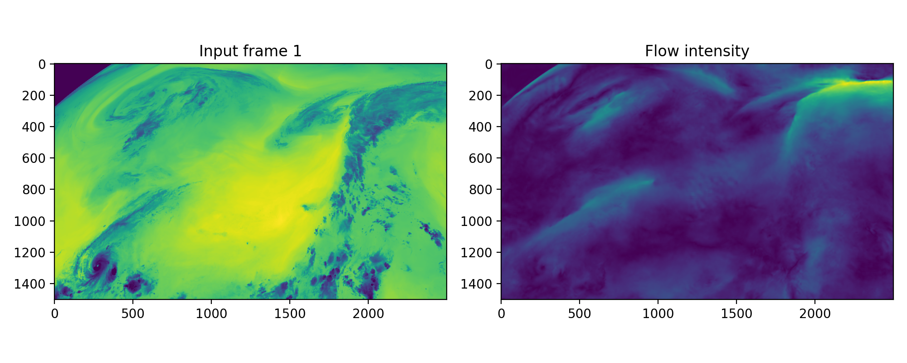

# windflow-light

Perform optical flow inference on geostationary satellite images from a pretrained RAFT model. 

## Install

`conda env create -f environment_cpu.yml`

## Usage
See  `python predict.py` for a basic example.

## Citation

Vandal, T., Duffy, K., McCarty, W., Sewnath, A., & Nemani, R. (2022). Dense feature tracking of atmospheric winds with deep optical flow, Proceedings of the 28th ACM SIGKDD Conference on Knowledge Discovery and Data Mining.

## Acknowledgements

External packages and flownet code was used from: https://github.com/celynw/flownet2-pytorch/  
Funded by NASA ROSES Earth Science Research from Geostationary Satellite Program (2020-2023)
